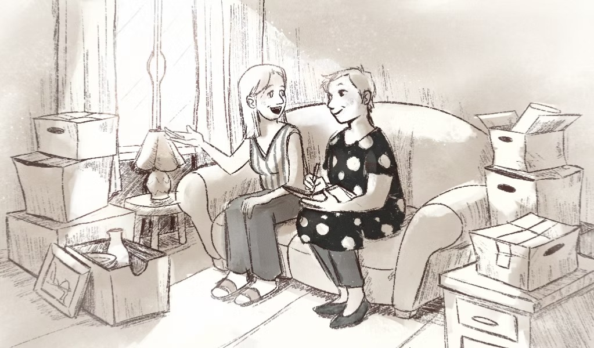

# Mom's Antique Appraisal — Landing Page

A single-page Hebrew landing page for an antique/inheritance appraisal service.
Optimized for Google Ads message-match based on 3 months of real campaign data.

## What's in here

- `index.html` — the entire site. One file. Plain HTML/CSS/JS, no build step.
- `README.md` — this file.
- `.gitignore` — standard ignore list for deploying via Git.

## Design system (so you know what you're editing)

- **Typography:** Frank Ruhl Libre (display serif) + Heebo (body) — both via Google Fonts.
- **Colors:** warm ivory background (`#f5efe6`), deep forest green primary (`#2d4a3e`), antique brass accent (`#a67c2e`), WhatsApp green CTAs (`#25D366`).
- **Direction:** RTL (Hebrew). Language: `he`.
- **All design tokens** are CSS variables at the top of the `<style>` block — change them there and the whole page updates.

## Placeholders you need to replace before launch

Search the file for these exact strings:

| Placeholder | What to replace with | Appears |
|---|---|---|
| `BUSINESS_NAME` | Real business/brand name | ~5 places |
| `WHATSAPP_NUMBER` | WhatsApp number, digits only with country code, e.g. `972501234567` | 2 places |
| `YEARS` | Years of experience (e.g. `20`) | 3 places |
| `FAMILIES+` | Families helped (e.g. `300+`) | 1 place |
| `TESTIMONIAL_NAME_1` / `TESTIMONIAL_NAME_2` | Real names + cities | 2 places |
| `YOUR-DOMAIN.co.il` | The actual domain | 2 places (meta tags) |
| `.img-placeholder` divs | Replace with real `` tags for cover + portrait | 2 places |

Every placeholder has a `<!-- TODO: ... -->` comment right next to it.

## Images

When you have them, create an `images/` folder next to `index.html` and drop in:

- `cover.jpg` — hero image, ideally ~800×1000px (4:5 ratio)
- `portrait.jpg` — photo of the business owner, square (1:1)

Then in `index.html`, find the two `<div class="img-placeholder">` blocks and replace with:

```html


```

(Commented-out examples are already there — just uncomment and delete the placeholder div.)

## First prompts to try in Claude Code

Good first prompts to get used to the workflow:

> "Replace all instances of BUSINESS_NAME with [actual name]"

> "Update the testimonials section. Here are two real ones: [paste text]"

> "Tighten the hero subhead — make it one sentence shorter"

> "Add an image at images/cover.jpg into the hero visual slot, replacing the placeholder"

## Deploying to Vercel via GitHub

1. In this folder's terminal:
   ```
   git init
   git add .
   git commit -m "initial landing page"
   ```
2. Create a new empty repo on GitHub, then:
   ```
   git remote add origin <YOUR_REPO_URL>
   git branch -M main
   git push -u origin main
   ```
3. Go to vercel.com → **New Project** → import your GitHub repo → **Deploy**. It's live in ~30 seconds.
4. In Vercel → Settings → Domains, add your real domain. Vercel will give you DNS records.
5. In Wix → Domains → Advanced → DNS Records, paste those records. SSL provisions automatically.

Every `git push` from now on auto-deploys. Very smooth.

## Keyword strategy baked into this page

Based on 3 months of Google Ads data (Jan–Apr 2026), the converting keyword pattern is `קונה [category]` — NOT inheritance/clearance framing. The page now mirrors this pattern in:

- H1
- Section titles
- All 12 category tiles
- Meta tags
- Schema.org `makesOffer` list

Top converters weighted into the page, in order:
1. קונה עתיקות (6 conv, ₪56 CPA, 11.5% CR)
2. קונה תכולת דירה (3 conv, ₪110 CPA)
3. הערכת עתיקות (2 conv, ₪14 CPA, 33% CR) — biggest magnet
4. קונה ציורים, sell antique, מי קונה כלי כסף, קונה עתיקות יד שניה (2 conv each)
5. קונה יודאיקה, קונה כסף ישן, מכירת עתיקות באינטרנט (1 conv each)

## After launch — Google Ads cleanup (separate job)

About ₪238/month is wasted on zero-converting keywords. When you're ready, add as **negative keywords**: `פינוי`, `סוחר עתיקות`, `וינטג'` (if not selling vintage clothing), `שמאי`, `גמולב`, `buy antique items` (English broad burning budget).
